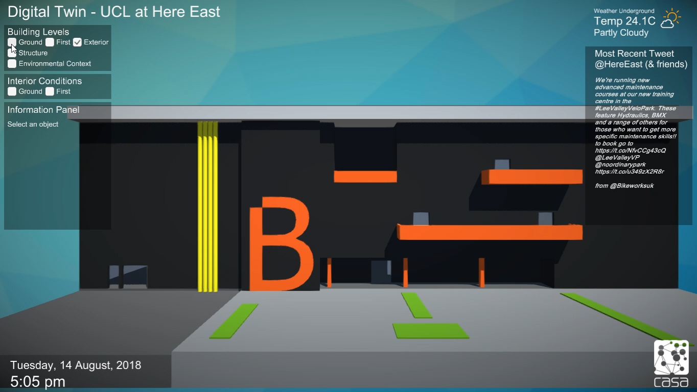
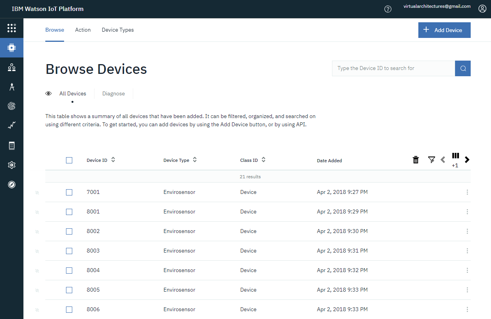
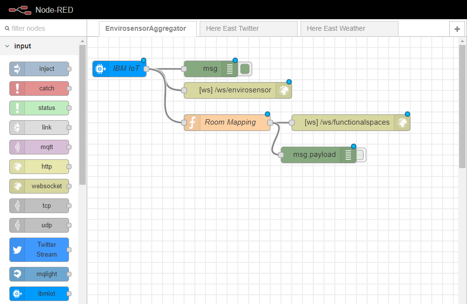
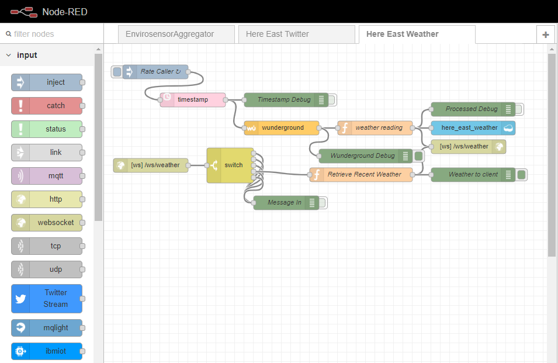
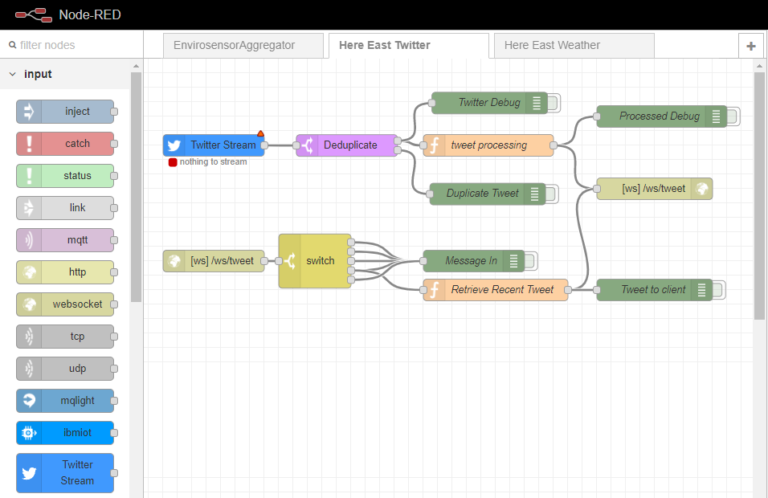

Here East Digital Twin Backend
==========================

This repository is a collection of Node-Red flows used to provide the backed for the implementation of a real-time 3D Digital Twin at the newly opened UCL campus at Here East on the Queen Elizabeth Olympic Park in London. The project ran for 6 months from April 2018 and was a collaboration between [The Bartlett Centre for Advanced Spatial Analysis (CASA)](https://www.ucl.ac.uk/bartlett/casa/) and the [Intel Collaborative Research Institute (ICRI) for Urban IoT](http://cities.io/) who provided use of their experiemental Envirosensor platform. Details of the sensor configuration are available in its own separate GitHub repository: [ICRI_Envirosensor](https://github.com/virtualarchitectures/ICRI_Envirosensor).

Further information about the project and its motivation can be found in the following paper:

### Dawkins, O., Dennett, A., Hudson-Smith, A. (2018) Living with a Digital Twin: Operational management and engagement using IoT and Mixed Realities at UCL’s Here East Campus on the Queen Elizabeth Olympic Park. GISRUK 2018, Leicester. [[PDF]](https://www.researchgate.net/profile/Oliver_Dawkins/publication/324702983_Living_with_a_Digital_Twin_Operational_management_and_engagement_using_IoT_and_Mixed_Realities_at_UCL%27s_Here_East_Campus_on_the_Queen_Elizabeth_Olympic_Park/links/5adddd11a6fdcc29358ba112/Living-with-a-Digital-Twin-Operational-management-and-engagement-using-IoT-and-Mixed-Realities-at-UCLs-Here-East-Campus-on-the-Queen-Elizabeth-Olympic-Park.pdf)

## Envirosensor Aggregator

The ICRI Envirosensors were registered on the IBM Watson IoT Platform which received each sensors data payload via RestAPI once every 60 seconds. Aggregated data were automatically backed up to a Cloudant database. This data would then be available for further analysis and could be examined for correlations with other available data streams. 

A separate Node-Red flow 'EnvirosensorAggregator' was connected to the IoT platform via MQTT protocol. These sensor reading were then passed to websockets so that they could be read by client applications in near real-time. One websocket provided the data as received from the IoT Platform. A second websocket provided a semantically enriched payload which linked the sensor reading to particular functional spaces or rooms within the building to provide more contextual information with greater relevance to the building managers, occupants and visitors to the site.

## Here East Weather

Further contextual information about surrounding environmental conditions was provided by the 'HereEastWeather' flow. This flow uses the 'inject' and 'wunderground' nodes to make an HTTP request to the Weather Underground weather API, centred on the coordinates of the Here East complex, once every five minutes. Timestamps were injected into the data payload and the readings were made available to client applications via a websocket. 

The most recent weather reading was also stored temporarily by the flow so that newly connecting clients would not have to wait for the next Weather Underground API call before displaying information to the user. Data were also backed up to a Cloudant database for later analysis against data streams such as those provided by the environmental sensors installed within the building.

**Note:** In May 2018 Weather Underground stopped distributing free API keys as a result of a decision by their parent companies The Weather Company and IBM. The API was officially restired at the end of 2018.

## Here East Twitter

A final stream of real-time data that was integrated for this trial was provide by the 'HereEastTwitter' flow. This used the 'Twitter Stream' node to connect to Twitter's real-time streaming API and retrieve any tweets addressed to the following accounts `@HereEast`, `@noordinarypark`, `@LondonStadium`, `@LondonLegacy`, `@AMOrbit`, `@LeeValleyVP`, `@CopperBoxArena`, `@AquaticsCentre`, `@westfieldstrat`, `@Plexalcity` and associated hashtags. In this way the Digital Twin could display publicly accessible information about the site and its neighbours. As with the previous, the most recent tweet was stored temporarily by the flow so that newly connecting clients would not have to wait for new activity in the Twitter Stream before displaying information to the user.

# Acknowledgements
Thanks to the [Intel Collaborative Research Institute (ICRI) for Urban IoT](http://cities.io/) for providing the Envirosensor platform.

This project is linked to research at CASA funded by the [Engineering and Physical Science Research Council (EPSRC)](https://epsrc.ukri.org/) and [Ordnance Survey (OS)](https://www.ordnancesurvey.co.uk/), the national mapping agency for Great Britain. 
